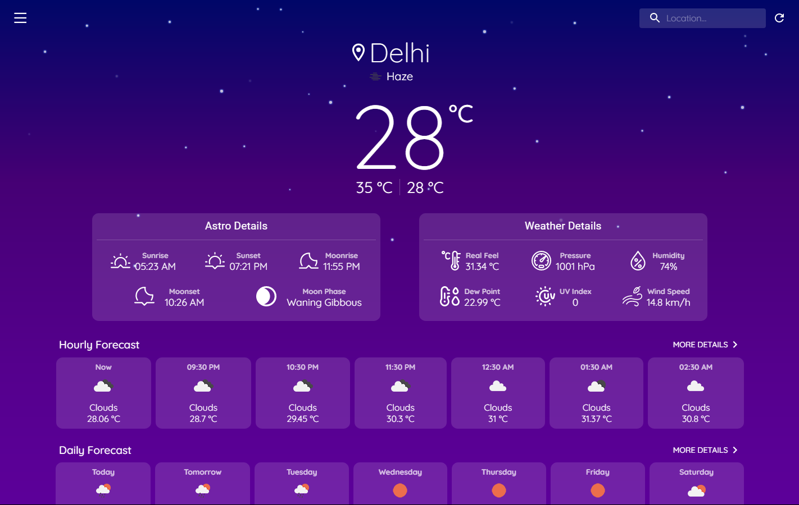
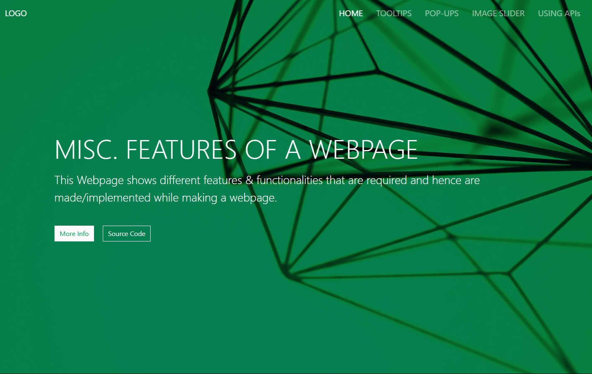

<p align="center">
    <a href="https://octodex.github.com/images/grim-repo.jpg" target="_blank">
        
    </a>
</p>

<h2 align="center">
    
    Heyooo!!! I'm Jaivrat
    
</h2>

<p align="center">
    
    
    <a href="https://basketo.finance" target="_blank">
        
    </a>
</p>

<p align="right">
    
</p>
<br />

---

<br />

```json
{
    "name": "Jaivrat Das",
    "installed_on": "12-Dec-2001",
    "location": "Madhya Pradesh, India",
    "roles": [
        {
            "role": "student",
            "institute": "Acropolis Institute of Technology & Research",
            "course": "Integrated Master of Computer Application",
            "duration": "5 Years (2019-2024)"
        },
        {
            "role": "intern",
            "company": "Basketo Finance (https://basketo.finance)",
            "position": "Full-Stack and WEB3 Development Intern",
            "duration": "6 Months (Jun-Nov, 2022)"
        }
    ],
    "updated_at": "04-Oct-2022"
}
```

- 👨‍💻 I'm a self-taught developer (mostly), and I love programming & problem solving
- 🤩 Some of my favorite things are: Sports (Football💜), Music, Anime
- 👨‍🏭 I'm currently working on some portfolio websites and mostly learning about stuffs
- 🧐 Currently learning:

    
    
    
    
    

<br />

<h2 align="center">🤩 I L💜VE to Create Things!!</h2>
<br />
<table>
    <tr>
        <th valign="center" width="33%">
            <div align="center">
                <a href="https://weather-app-elite.vercel.app/" target="_blank">
                    
                </a>
            </div>
        </th>
        <th valign="center" width="33%">
            <div align="center">
                <a href="https://play.unity.com/mg/other/explosion-magic" target="_blank">
                    
                </a>
            </div>
        </th>
        <th valign="center" width="33%">
            <div align="center">
                <a href="https://jaivrat12.github.io/misc-features-webpage/" target="_blank">
                    
                </a>
            </div>
        </th>
    </tr>
    <tr>
        <td valign="top" width="33%">
            <div align="center">
                <a href="https://weather-app-elite.vercel.app/" target="_blank">
                    <b>Weather App (React.js)</b>
                </a>
                <br />
                <a href="https://github.com/Jaivrat12/weather-app" target="_blank">
                    View Repo
                </a>
            </div>
        </td>
        <td valign="top" width="33%">
            <div align="center">
                <a href="https://play.unity.com/mg/other/explosion-magic" target="_blank">
                    <b>Explosion Magic (Unity3D)</b>
                </a>
                <br />
                <a href="https://github.com/Jaivrat12/unity-explosion-magic" target="_blank">
                    View Repo
                </a>
            </div>
        </td>
        <td valign="top" width="33%">
            <div align="center">
                <a href="https://jaivrat12.github.io/misc-features-webpage/" target="_blank">
                    <b>Misc Features (Vanilla JS)</b>
                </a>
                <br />
                <a href="https://github.com/Jaivrat12/misc-features-webpage" target="_blank">
                    View Repo
                </a>
            </div>
        </td>
    </tr>
</table>

<br />

<h2 align="center">🚀 Technologies and Tools 🛠️</h2>
<br />
<p align="center">
    
    
    
    
    
    
    
    
    
    
    
    
    
    
    
    
    
    
    
    
    
    
    
    
    
    
    
    
    
    
    
    
    
    
    
    
    
    
    
    
    
    
    
    
    
</p>
<br />

<details>
    <summary>💹 GitHub Stats</summary>
    <p align="center">
        
        
    </p>
    <p align="center">
        
        
    </p>
    <p align="right">
        <a href="https://profile-summary-for-github.com/user/Jaivrat12" target="_blank">
            View More Stats ↗
        </a>
    </p>
</details>

<br />

---

<br />

<p align="right">
    <a href="https://www.codechef.com/users/jaivrat1" target="_blank">
        
    </a>
    <a href="https://www.youtube.com/channel/UCte2wZPAzIUA4odJ5Mg_OyA" target="_blank">
        
    </a>
    <a href="https://www.linkedin.com/in/jaivratdas/" target="_blank">
        
    </a>
    <!-- <a href="https://www.reddit.com/user/Most_Detective_7136" target="_blank">
        
    </a> -->
    <!-- <a href="https://replit.com/@JaivratDas" target="_blank">
        
    </a> -->
    <a href="https://www.sololearn.com/profile/12363610" target="_blank">
        
    </a>
    <a href="https://play.unity.com/u/jaivrat1" target="_blank">
        
    </a>
</p>

<p align="center">
    
</p>
