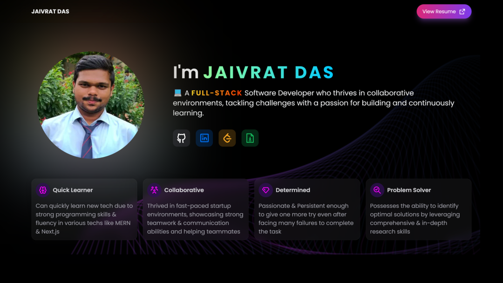

<p align="center">
    <a href="https://octodex.github.com/images/grim-repo.jpg" target="_blank">
        
    </a>
    <br />
    <a href="https://jaivratdas.in/" target="_blank">
        
    </a>
</p>

<h2 align="center">
    
    Hello! I'm Jaivrat Das
    
</h2>

<p align="center">
    
    
    <!-- <a href="https://basketo.finance" target="_blank">
        
    </a> -->
</p>

<p align="right">
    
</p>
<br /><br />

```json
{
    "name": "Jaivrat Das",
    "installed_on": "12-Dec-2001",
    "location": "Indore, Madhya Pradesh, India",
    "education": {
        "institute": "Acropolis Institute of Technology & Research",
        "course": "Integrated Masters in Computer Application",
        "duration": "5 Years (2019-2024)"
    },
    "carrer": [
        {
            "company": "A Logistics Company (USA)",
            "role": "Freelancer",
            "position": "Full-Stack Developer",
            "duration": "10 Months (Apr 2023 - Jan 2024)"
        },
        {
            "company": "Basketo Finance",
            "role": "Intern",
            "position": "Full-Stack and WEB3 Development Intern",
            "duration": "6 Months (Jun 2022 - Nov 2022)"
        }
    ],
    "total_experience": "1+ YoE",
    "updated_at": "14-Feb-2024"
}
```

- 👨‍💻 I'm a collaborative & passionate Full-Stack Developer specializing in MERN Stack.
- 🤩 Some of my favorite things are: Problem Solving, Sports (Football💜), Music, Anime
- 👨‍🏭 I'm currently working on various projects like [My Portfolio](https://jaivratdas.in/), [Family Tree Maker](https://clannad.jaivratdas.in/)
- 🧐 Currently learning/improving on:

    
    
    

<br />

<h2 align="center">🤩 I L💜VE to Create Things!!</h2>
<br />
<table>
    <tr>
        <th valign="center" width="33%">
            <div align="center">
                <a href="https://clannad.jaivratdas.in/" target="_blank">
                    
                </a>
            </div>
        </th>
        <th valign="center" width="33%">
            <div align="center">
                <a href="https://jaivratdas.in/" target="_blank">
                    
                </a>
            </div>
        </th>
    </tr>
    <tr>
        <td valign="top" width="33%">
            <div align="center">
                <a href="https://clannad.jaivratdas.in/" target="_blank">
                    <b>Family Tree Maker (Next.js + MERN)</b>
                </a>
                <br />
                <a href="https://github.com/Jaivrat12/clannad-family-tree" target="_blank">
                    View Repo
                </a>
            </div>
        </td>
        <td valign="top" width="33%">
            <div align="center">
                <a href="https://jaivratdas.in/" target="_blank">
                    <b>My Portfolio Website (Next.js)</b>
                </a>
                <br />
                <a href="https://github.com/Jaivrat12/jaivrat-das" target="_blank">
                    View Repo
                </a>
            </div>
        </td>
    </tr>
    <tr>
        <th valign="center" width="33%">
            <div align="center">
                <a href="https://weather-app-elite.vercel.app/" target="_blank">
                    
                </a>
            </div>
        </th>
        <th valign="center" width="33%">
            <div align="center">
                <a href="https://github-clone.jaivratdas.in/" target="_blank">
                    
                </a>
            </div>
        </th>
    </tr>
    <tr>
        <td valign="top" width="33%">
            <div align="center">
                <a href="https://weather-app-elite.vercel.app/" target="_blank">
                    <b>Weather App (React.js)</b>
                </a>
                <br />
                <a href="https://github.com/Jaivrat12/weather-app" target="_blank">
                    View Repo
                </a>
            </div>
        </td>
        <td valign="top" width="33%">
            <div align="center">
                <a href="https://github-clone.jaivratdas.in/" target="_blank">
                    <b>GitHub Clone (Vanilla JS)</b>
                </a>
                <br />
                <a href="https://github.com/Jaivrat12/github-clone" target="_blank">
                    View Repo
                </a>
            </div>
        </td>
    </tr>
    <tr>
        <th valign="center" width="33%">
            <div align="center">
                <video controls src="images/explosion-magic.mp4"></video>
            </div>
        </th>
        <th valign="center" width="33%">
            <div align="center">
                <a href="https://jaivrat12.github.io/misc-features-webpage/" target="_blank">
                    
                </a>
            </div>
        </th>
    </tr>
    <tr>
        <td valign="top" width="33%">
            <div align="center">
                <a href="https://play.unity.com/mg/other/explosion-magic" target="_blank">
                    <b>Explosion Magic (Unity3D)</b>
                </a>
                <br />
                <a href="https://github.com/Jaivrat12/unity-explosion-magic" target="_blank">
                    View Repo
                </a>
            </div>
        </td>
        <td valign="top" width="33%">
            <div align="center">
                <a href="https://jaivrat12.github.io/misc-features-webpage/" target="_blank">
                    <b>Misc Features (Vanilla JS)</b>
                </a>
                <br />
                <a href="https://github.com/Jaivrat12/misc-features-webpage" target="_blank">
                    View Repo
                </a>
            </div>
        </td>
    </tr>
</table>

<br />

<h2 align="center">🚀 Technologies and Tools 🛠️</h2>
<br />
<p align="center">
    <b>Languages</b>
    <br />
    
    
    
    
    <br />
    <br />
    <b>Frameworks/Libraries/DBs</b>
    <br />
    
    
    
    
    
    <br />
    
    
    
    
    
    <br />
    
    
    <br />
    <br />
    <b>Others</b>
    <br />
    
    
    
    
    <br />
    
    
    
</p>
<br />

<details>
    <summary>💹 GitHub Stats</summary>
    <p align="center">
        
        
    </p>
    <p align="center">
        
        
    </p>
    <p align="right">
        <a href="https://profile-summary-for-github.com/user/Jaivrat12" target="_blank">
            View More Stats ↗
        </a>
    </p>
</details>

<br />

---

<br />

<p align="right">
    <a href="https://jaivratdas.in/" target="_blank">
        
    </a>
    <a href="https://leetcode.com/jaivrat12/" target="_blank">
        
    </a>
    <a href="https://www.codechef.com/users/jaivrat1" target="_blank">
        
    </a>
    <a href="https://www.linkedin.com/in/jaivratdas/" target="_blank">
        
    </a>
    <a href="https://www.sololearn.com/profile/12363610" target="_blank">
        
    </a>
</p>

<p align="center">
    
</p>
